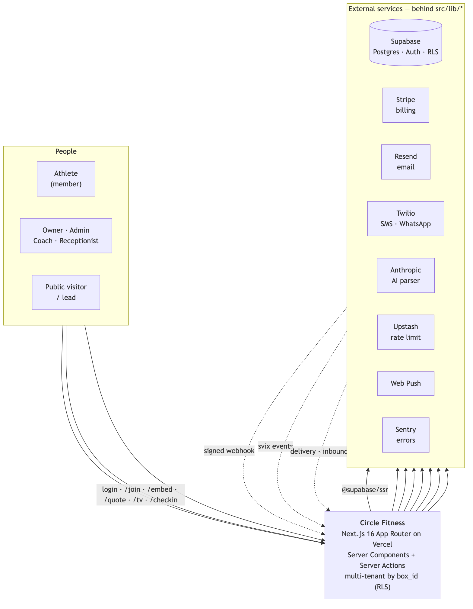

# Circle Glofox

Multi-tenant gym-management SaaS — classes & scheduling, memberships & payments, UAE VAT invoicing, waivers, WODs/lifts, leads, and automated billing reminders. Each gym ("box") is isolated by Postgres Row-Level Security.

## Stack
- **Next.js 16** (App Router, server actions) · TypeScript · Tailwind
- **Supabase** — Postgres + Auth (email OTP). RLS keyed on `box_id` is the multi-tenancy backstop.
- **Stripe** — payments via a provider-agnostic PSP abstraction (`src/lib/psp`)
- **Resend** — billing-reminder / dunning email
- **Sentry** — error monitoring · **Upstash** — optional per-IP rate limiting
- **Vitest** — unit tests · **ESLint 9** (flat config) · **Husky** + lint-staged

## Architecture
System context below; the full picture — request lifecycle (the server-action house shape), multi-tenant RLS model, module map, the 78-table data domains, and background crons/webhooks — is in [`docs/ARCHITECTURE.md`](docs/ARCHITECTURE.md) as Mermaid diagrams.



## Getting started
```bash
npm install
cp .env.example .env.local   # fill in the values (see below)
npm run dev                  # http://localhost:3001
```

### Environment variables
All keys are documented in [`.env.example`](.env.example) and validated at startup by [`src/env.ts`](src/env.ts) — a missing/invalid required var **fails the build loudly**. Required: Supabase URL/anon/service-role, `NEXT_PUBLIC_APP_URL`, `RESEND_API_KEY`, `CRON_SECRET` (16+), `PORTAL_SIGN_SECRET` (32+). Optional: Upstash (rate limiting), Sentry.

> Keep `NEXT_PUBLIC_APP_URL=http://localhost:3001` locally. The production value lives only in Vercel env vars. `NEXT_PUBLIC_*` are build-time — changing them needs a redeploy.

## Scripts
| Script | What |
|---|---|
| `npm run dev` | dev server (:3001) |
| `npm run build` | production build |
| `npm run lint` | ESLint (flat config) |
| `npm run type-check` | `tsc --noEmit` |
| `npm run test` / `test:coverage` | Vitest (coverage thresholds 70/70/60/70 on `_lib`) |

## Database & migrations
Postgres on Supabase. Migrations are applied **manually in the Supabase SQL Editor** — see [`migrations/README.md`](migrations/README.md) for run order and the canonical-schema (`pg_dump`) workflow. New migrations: next number in `migrations/`, idempotent, with a `-- ROLLBACK:` block.

## Deployment
Vercel, auto-deploys on push to `main` (Production: `https://circle-glofox-rep.vercel.app`). CI (GitHub Actions) runs lint, type-check, coverage, and secret-scanning on every push/PR; the production build runs on Vercel.

## CI/CD & quality gates
- **CI** ([.github/workflows/ci.yml](.github/workflows/ci.yml)): lint → type-check → test+coverage → gitleaks secret scan.
- **Pre-commit** (Husky + lint-staged): ESLint `--max-warnings=0` on staged `.ts/.tsx`.
- Node pinned to 22 (`.nvmrc`).

## Security & operations
- Architecture/security/process/recovery review: [`docs/audit/`](docs/audit/).
- Disaster recovery & incident response: [`docs/runbooks/disaster-recovery.md`](docs/runbooks/disaster-recovery.md).
- Security headers + CSP in [`next.config.mjs`](next.config.mjs); rate limiting in [`src/lib/rate-limit.ts`](src/lib/rate-limit.ts).
