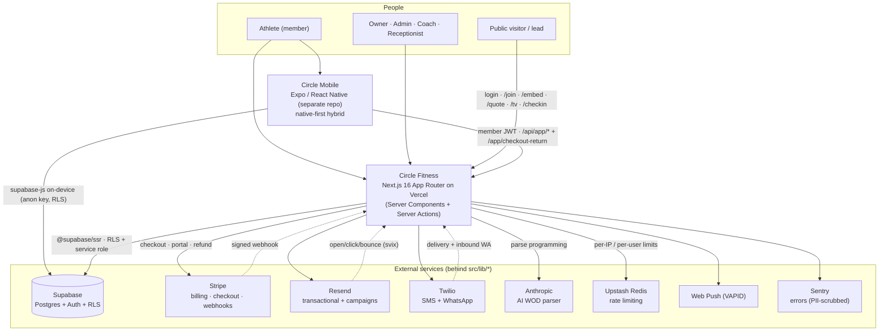
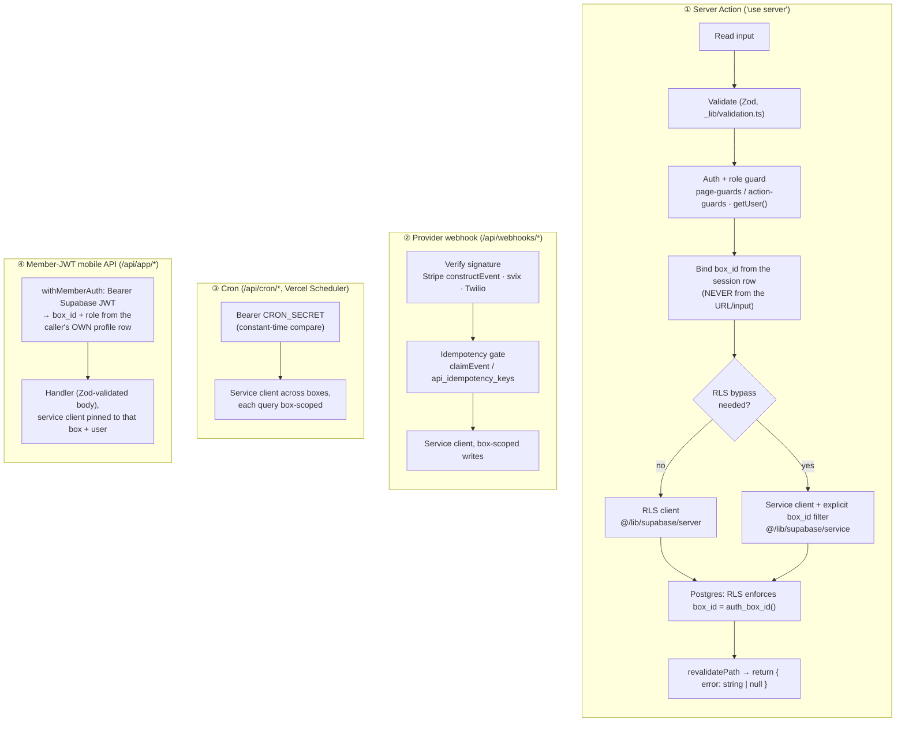
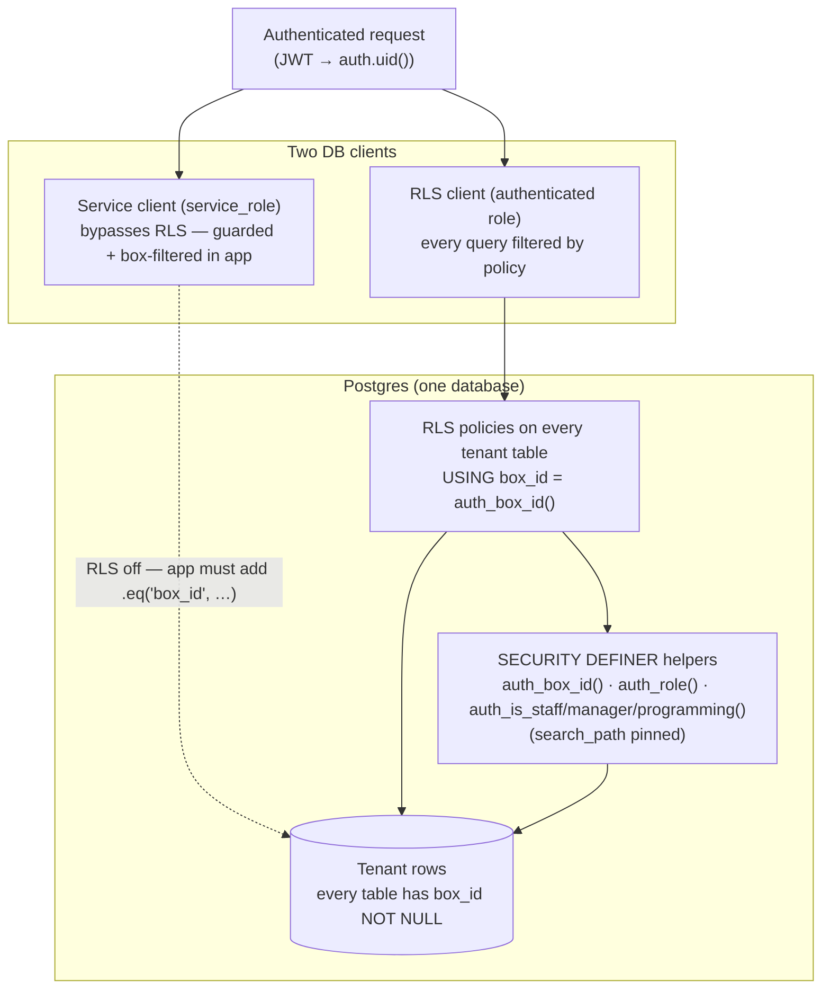
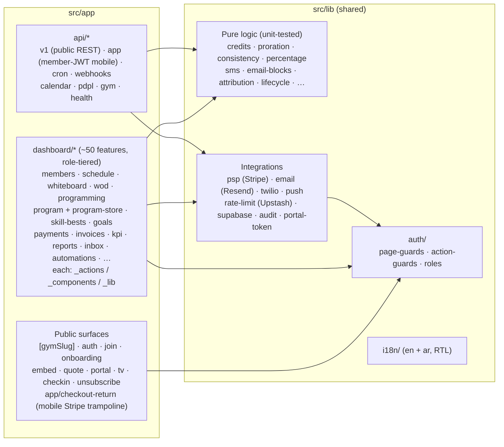
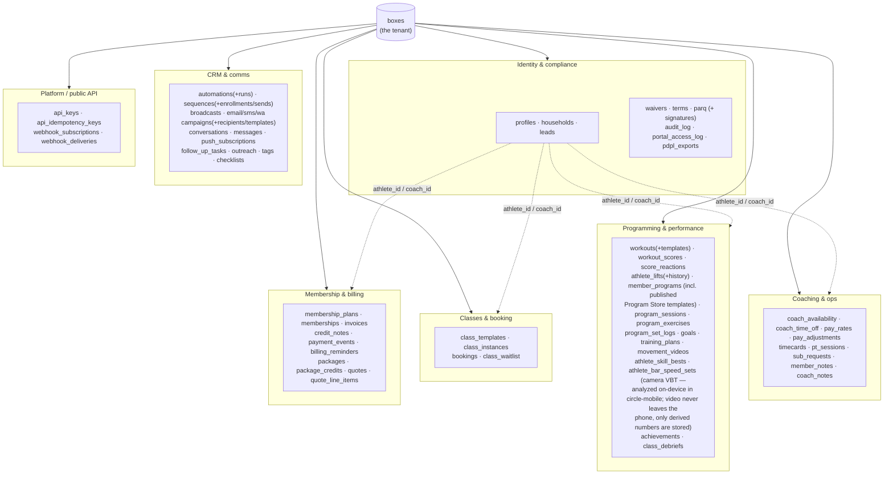
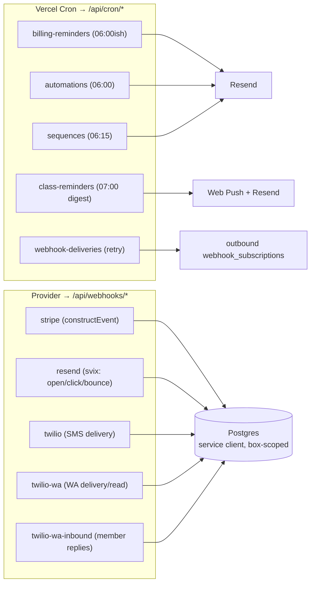

# Architecture — Circle Fitness

How the system is built and how the pieces fit together. This is the **what/how-it-fits**;
the **why** lives in [`decisions/`](../decisions/) (ADRs), **how it scales** in
[`docs/ops/scaling-playbook.md`](ops/scaling-playbook.md), and **how it's audited** in
[`docs/audit/CHECKLIST.md`](audit/CHECKLIST.md).

> **Keep this current:** the diagrams are [Mermaid](https://mermaid.js.org) (text → renders on
> GitHub/VSCode). When you add an external service, a top-level route group, a cron/webhook, or a
> new data domain, update the relevant view here. A polished export of View 1 lives at
> [`architecture.png`](architecture.png) for the README / decks.

**Stack (locked):** Next.js 16 App Router + TypeScript (strict) · Supabase (Postgres + Auth + RLS) ·
Tailwind/shadcn · Vercel. Multi-tenant: one codebase serving many gyms ("boxes"), isolated by `box_id` in Postgres RLS.

---

## 1. System context

Who uses it and what it talks to. One Next.js app on Vercel is the only compute; one Supabase Postgres is the only datastore; everything else is an integration behind `src/lib/*`.

---

## 2. Request lifecycle — the house shape

Almost all writes flow through a **server action** with the same pipeline. The discipline is: *validate → guard → bind tenant from session → tenant-scoped query → revalidate → return `{ error }`*. There are four entry types — user actions, provider webhooks, crons, and the member-JWT mobile API.

See [`docs/loop/ACCESS-CONTROL.md`](loop/ACCESS-CONTROL.md) for the **G ⊆ P** rule (guard roles ⊆ RLS-policy roles) every action/page must satisfy, and [ADR 001](../decisions/001_service_role_key_is_server_only.md) for why the service-role key is server-only.

---

## 3. Multi-tenant isolation — the prime invariant

One gym = one **box**. Isolation is enforced in **Postgres RLS**, not application code. App-layer `.eq('box_id', …)` filters are defense-in-depth, never the sole guard.

**Enforced (not just advised):** the `rls-isolation` CI gate (`tests/rls/run.mjs`) replays the schema on a throwaway Postgres and asserts cross-box reads/writes are denied; `verify-policy-roles` + `access-control-table` hold the G⊆P alignment. PII columns on `profiles` (medical, national ID) are revoked at the column-grant level — only the service role reads them.

---

## 4. Module map

App Router with a **feature-folder** convention: each dashboard feature owns its `_actions` (server actions), `_components` (client UI), and `_lib` (pure validators). Cross-feature logic + integrations live in `src/lib`. A modular monolith by deliberate choice ([ADR 002](../decisions/002_modular_monolith_no_microservices.md)).

**Convention:** a feature is `dashboard/<feature>/{page.tsx, _actions/*.ts, _components/*.tsx, _lib/validation.ts}`. Validators are pure (`string | null`) and unit-tested; integrations are isolated so a provider swap touches one `src/lib` module.

---

## 5. Data domains

78 tables in one Postgres, grouped by domain. **Every tenant table carries `box_id NOT NULL` referencing `boxes` (ON DELETE CASCADE)** and an RLS policy. Person-scoped rows reference `profiles` with a deliberate `ON DELETE` rule (CASCADE for own data, SET NULL for authorship — [migration 088](../migrations/088_member_removal_fk_cleanup.sql)).

*(Diagram shows representative tables per domain; the full 78-table list is the grouping above. Migration history + reverse procedures: [`migrations/`](../migrations/) + [`ROLLBACKS.md`](../migrations/ROLLBACKS.md).)*

---

## 6. Background work — crons & webhooks

Unattended work runs as **Vercel-scheduled crons** (authenticated by `CRON_SECRET`) and **inbound provider webhooks** (signature-verified + idempotent). Both use the service client and scope every query by box.

There's also a **public REST API** (`/api/v1/*`: members, memberships, classes, bookings, leads, packages, `openapi.json`) authenticated by hashed `api_keys`, and per-athlete **ICS calendar** feeds (`/api/calendar/[token]`) and **PDPL export** (`/api/pdpl/export`).

The **member-JWT mobile API** (`/api/app/*`: profile, membership + buy/pay-now, bookings, agreements, plan-change, referral, calendar-token, pack + program checkout) serves the Circle Mobile app; each route runs through `withMemberAuth` (View 2 ④). Mobile Stripe checkouts return via the public `/app/checkout-return` trampoline (strict custom-scheme allowlist → deep-link back into the app), and mobile **self-signup** is provisioned by a `SECURITY DEFINER` trigger on `auth.users` (migration 087 — box chosen server-side from the `self_signup_default` flag, never from client input).

---

## Maintenance

| When you… | Update |
|---|---|
| Add an external service | View 1 + the Stack line |
| Add a top-level route group under `src/app` | View 4 |
| Add a cron or webhook | View 6 |
| Add a table / data domain | View 5 |
| Make a durable architectural ruling | a new ADR in `decisions/` (then link it here) |

*Last grounded against the codebase: 2026-07-05.*
